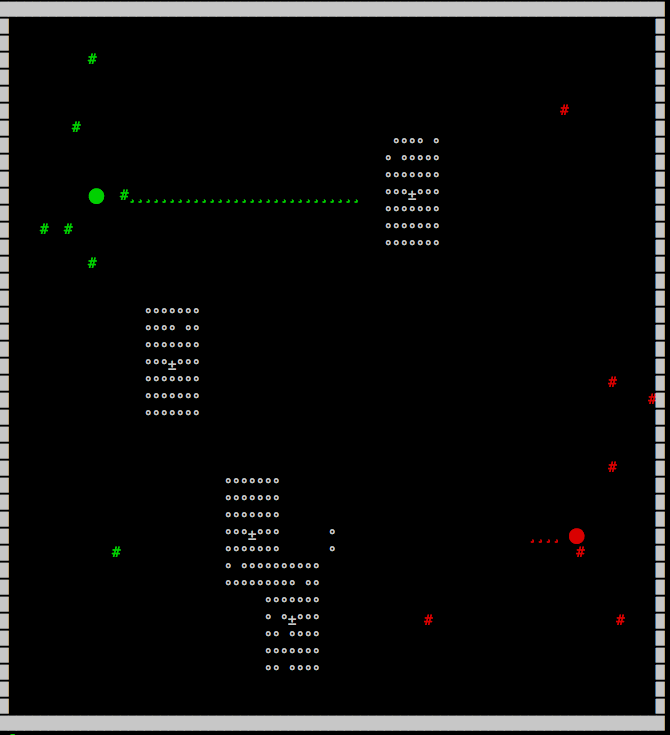

# drone

A little anthill simulator in the terminal. Ants run around, eat food, attack each other, and so on. Like a fish tank without the responsibility.

Food spawns from those little tree things near the center of the map. When an ant steps on some food, it carries it back to its anthill, laying down a pheromone trail along the way to let other ants know where the food was.
